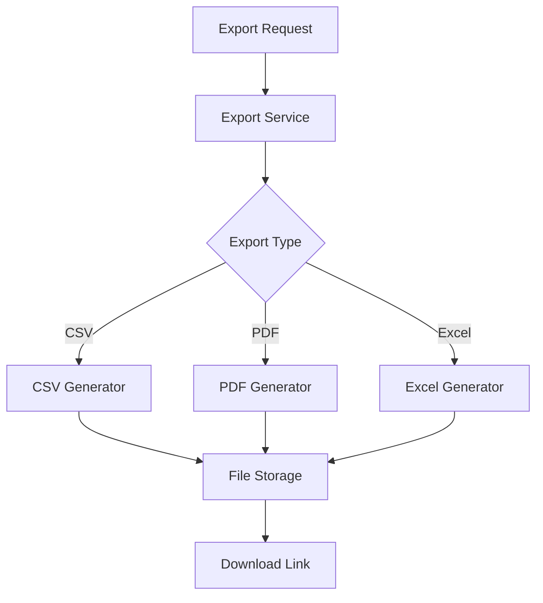
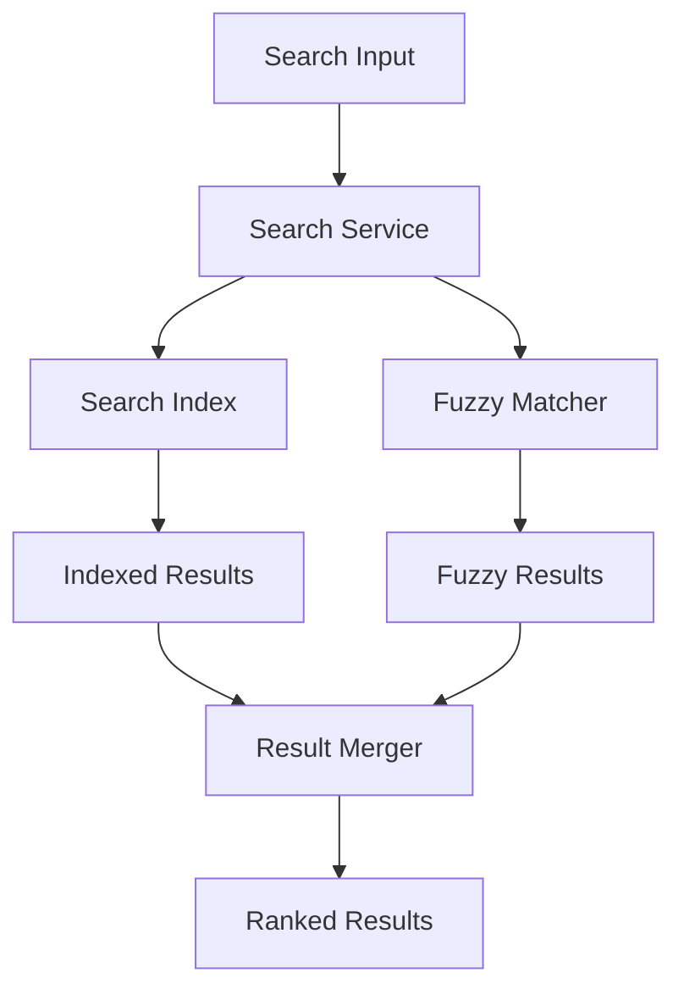
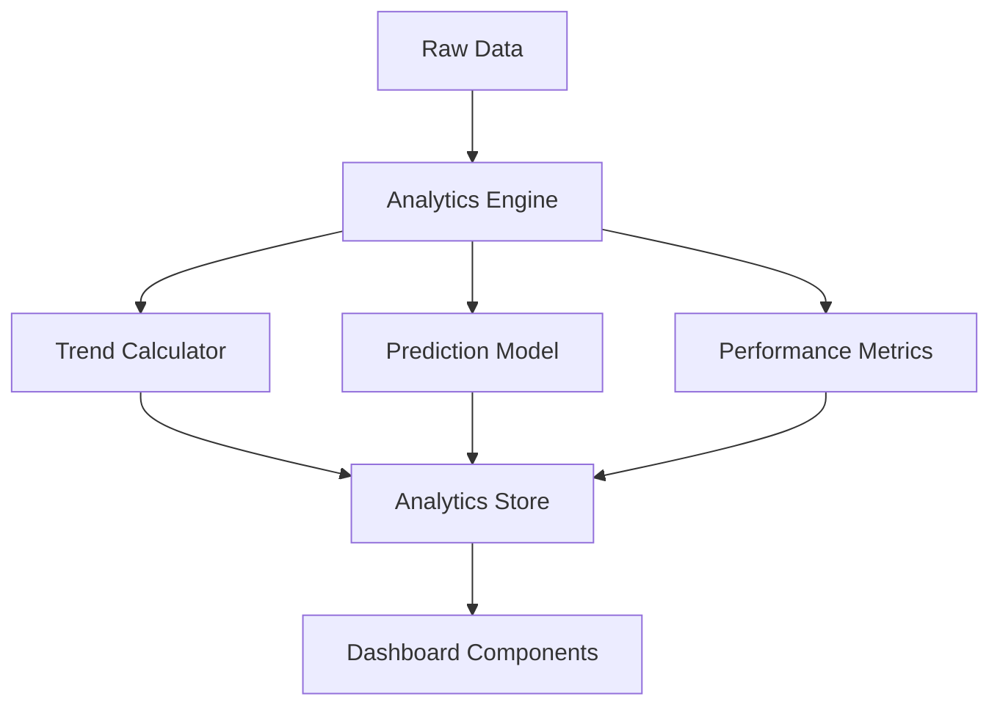
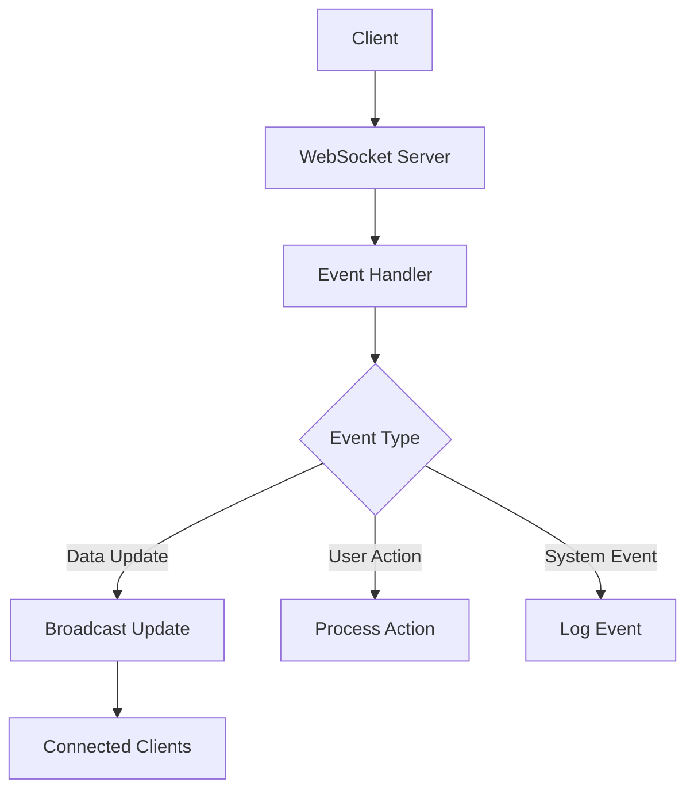

# Advanced Player Tracker Features Framework

## 📋 **Implementation Roadmap Overview**

### **Phase 3: Core Enhancements (Weeks 1-2)**
1. **Enhanced Export System** - CSV/PDF with advanced formatting
2. **Global Search System** - Fuzzy search across all data
3. **Mobile Optimization** - Responsive design improvements

### **Phase 4: Advanced Analytics (Weeks 3-4)**
4. **Analytics Dashboard** - Trend analysis and predictions
5. **Real-time Features** - WebSocket integration
6. **Advanced Player Cards** - Comparison and analysis tools

### **Phase 5: Enterprise Features (Weeks 5-6)**
7. **Data Management** - Bulk operations and validation
8. **Administrative Tools** - User management and monitoring
9. **Performance Optimization** - Caching and indexing

---

## 🎯 **Priority Matrix**

| Feature | Priority | Complexity | Impact | Timeline |
|---------|----------|------------|--------|----------|
| Enhanced Export System | **HIGH** | Medium | High | Week 1 |
| Global Search | **HIGH** | Medium | High | Week 1 |
| Mobile Optimization | **HIGH** | Low | High | Week 2 |
| Advanced Analytics | Medium | High | Medium | Week 3 |
| Real-time Features | Medium | High | Medium | Week 3-4 |
| Advanced Player Cards | Medium | Medium | Medium | Week 4 |
| Data Management | Low | Medium | Low | Week 5 |
| Administrative Tools | Low | High | Low | Week 5-6 |
| Performance Optimization | Low | High | High | Week 6 |

---

## 🔧 **Technical Architecture**

### **Technology Stack Additions**
```typescript
// New Dependencies
{
  // Export & PDF Generation
  "jspdf": "^2.5.1",
  "jspdf-autotable": "^3.5.31",
  "html2canvas": "^1.4.1",
  
  // Search & Analytics
  "fuse.js": "^7.0.0",
  "date-fns": "^2.30.0",
  "recharts": "^2.8.0",
  
  // Real-time Features
  "socket.io": "^4.7.4",
  "socket.io-client": "^4.7.4",
  
  // Performance & Caching
  "redis": "^4.6.10",
  "ioredis": "^5.3.2",
  
  // Mobile & UI
  "framer-motion": "^10.16.16",
  "react-spring": "^9.7.3"
}
```

### **Database Schema Extensions**
```prisma
// Additional Models for Advanced Features

model SearchIndex {
  id          String   @id @default(cuid())
  entityType  String   // 'player', 'alliance', 'snapshot'
  entityId    String
  searchText  String   // Concatenated searchable text
  keywords    String[] // Extracted keywords
  createdAt   DateTime @default(now())
  updatedAt   DateTime @updatedAt
  
  @@index([entityType, searchText])
  @@index([keywords])
}

model UserPreferences {
  id              String   @id @default(cuid())
  user            User     @relation(fields: [userId], references: [id])
  userId          String   @unique
  theme           String   @default("dark")
  defaultView     String   @default("overview")
  notifications   Json     // Notification preferences
  bookmarkedPlayers String[] // Player IDs
  customDashboard Json     // Dashboard layout
  createdAt       DateTime @default(now())
  updatedAt       DateTime @updatedAt
}

model SystemLog {
  id        String   @id @default(cuid())
  level     String   // 'info', 'warn', 'error'
  message   String
  metadata  Json?
  userId    String?
  action    String?
  timestamp DateTime @default(now())
  
  @@index([level, timestamp])
  @@index([userId, timestamp])
}

model CacheEntry {
  id        String   @id @default(cuid())
  key       String   @unique
  value     Json
  expiresAt DateTime
  createdAt DateTime @default(now())
  
  @@index([expiresAt])
}
```

---

## 📊 **Feature Implementation Details**

### **1. Enhanced Export System**

#### **Architecture**


#### **Implementation Structure**
```typescript
// src/lib/export/ExportService.ts
export class ExportService {
  static async exportData(options: ExportOptions): Promise<ExportResult>
  static async generatePDF(data: any[], template: PDFTemplate): Promise<Buffer>
  static async generateCSV(data: any[], config: CSVConfig): Promise<string>
  static async generateExcel(data: any[], config: ExcelConfig): Promise<Buffer>
}

// src/lib/export/PDFGenerator.ts
export class PDFGenerator {
  static async createPlayerCard(player: Player): Promise<Buffer>
  static async createSummaryReport(data: SummaryData): Promise<Buffer>
  static async createLeaderboardReport(data: LeaderboardData): Promise<Buffer>
}

// src/components/export/ExportDialog.tsx
export function ExportDialog({ data, type }: ExportDialogProps)
```

### **2. Global Search System**

#### **Search Architecture**


#### **Implementation Structure**
```typescript
// src/lib/search/SearchService.ts
export class SearchService {
  static async globalSearch(query: string): Promise<SearchResult[]>
  static async indexEntity(entity: any, type: string): Promise<void>
  static async rebuildIndex(): Promise<void>
}

// src/lib/search/FuzzyMatcher.ts
export class FuzzyMatcher {
  static searchPlayers(query: string): Promise<Player[]>
  static searchAlliances(query: string): Promise<Alliance[]>
  static calculateRelevance(item: any, query: string): number
}

// src/components/search/GlobalSearch.tsx
export function GlobalSearch({ onSelect }: GlobalSearchProps)
```

### **3. Mobile Optimization**

#### **Responsive Design Strategy**
```typescript
// src/hooks/useResponsive.ts
export function useResponsive() {
  const [breakpoint, setBreakpoint] = useState<Breakpoint>('desktop')
  const [isMobile, setIsMobile] = useState(false)
  const [isTablet, setIsTablet] = useState(false)
}

// src/components/mobile/MobileLayout.tsx
export function MobileLayout({ children }: MobileLayoutProps)

// src/components/mobile/TouchGestures.tsx
export function TouchGestures({ onSwipe, onPinch }: TouchGesturesProps)
```

### **4. Advanced Analytics Dashboard**

#### **Analytics Architecture**


#### **Implementation Structure**
```typescript
// src/lib/analytics/AnalyticsEngine.ts
export class AnalyticsEngine {
  static async calculateTrends(data: TimeSeriesData): Promise<TrendAnalysis>
  static async predictGrowth(player: Player): Promise<GrowthPrediction>
  static async analyzePerformance(alliance: Alliance): Promise<PerformanceMetrics>
}

// src/lib/analytics/TrendCalculator.ts
export class TrendCalculator {
  static calculatePowerTrend(snapshots: PlayerSnapshot[]): TrendData
  static calculateAllianceGrowth(alliance: Alliance): GrowthData
  static detectAnomalies(data: number[]): Anomaly[]
}

// src/components/analytics/TrendChart.tsx
export function TrendChart({ data, type }: TrendChartProps)
```

### **5. Real-time Features**

#### **WebSocket Architecture**


#### **Implementation Structure**
```typescript
// src/lib/realtime/WebSocketServer.ts
export class WebSocketServer {
  static initialize(server: Server): void
  static broadcastUpdate(event: RealtimeEvent): void
  static handleConnection(socket: Socket): void
}

// src/lib/realtime/EventManager.ts
export class EventManager {
  static emit(event: string, data: any): void
  static subscribe(event: string, callback: Function): void
  static unsubscribe(event: string, callback: Function): void
}

// src/hooks/useRealtime.ts
export function useRealtime(events: string[])
```

### **6. Advanced Player Card Features**

#### **Comparison System**
```typescript
// src/lib/comparison/PlayerComparator.ts
export class PlayerComparator {
  static compare(players: Player[]): ComparisonResult
  static calculateSimilarity(p1: Player, p2: Player): number
  static generateInsights(comparison: ComparisonResult): Insight[]
}

// src/components/player/PlayerComparison.tsx
export function PlayerComparison({ players }: PlayerComparisonProps)

// src/components/player/PerformanceScoring.tsx
export function PerformanceScoring({ player }: PerformanceScoringProps)
```

### **7. Data Management Enhancements**

#### **Bulk Operations**
```typescript
// src/lib/data/BulkOperations.ts
export class BulkOperations {
  static async bulkImport(files: File[]): Promise<ImportResult>
  static async bulkDelete(criteria: DeleteCriteria): Promise<DeleteResult>
  static async validateData(data: any[]): Promise<ValidationResult>
}

// src/lib/data/DataValidator.ts
export class DataValidator {
  static validatePlayerData(data: any): ValidationResult
  static validateFileFormat(file: File): boolean
  static sanitizeData(data: any): any
}
```

### **8. Administrative Tools**

#### **Admin Dashboard**
```typescript
// src/lib/admin/UserManager.ts
export class UserManager {
  static async createUser(userData: CreateUserData): Promise<User>
  static async updatePermissions(userId: string, permissions: Permission[]): Promise<void>
  static async getSystemStats(): Promise<SystemStats>
}

// src/lib/admin/SystemMonitor.ts
export class SystemMonitor {
  static async getPerformanceMetrics(): Promise<PerformanceMetrics>
  static async getErrorLogs(): Promise<ErrorLog[]>
  static async getAuditTrail(): Promise<AuditEntry[]>
}

// src/components/admin/AdminDashboard.tsx
export function AdminDashboard()
```

### **9. Performance Optimization**

#### **Caching Strategy**
```typescript
// src/lib/cache/CacheManager.ts
export class CacheManager {
  static async get<T>(key: string): Promise<T | null>
  static async set(key: string, value: any, ttl?: number): Promise<void>
  static async invalidate(pattern: string): Promise<void>
}

// src/lib/cache/QueryOptimizer.ts
export class QueryOptimizer {
  static optimizePlayerQuery(filters: PlayerFilters): OptimizedQuery
  static addIndexes(): Promise<void>
  static analyzeQueryPerformance(): Promise<QueryAnalysis>
}
```

---

## 🚀 **Implementation Timeline**

### **Week 1: Enhanced Export & Search**
- [ ] Implement PDF generation service
- [ ] Create advanced CSV export with formatting
- [ ] Build global search infrastructure
- [ ] Add fuzzy search capabilities

### **Week 2: Mobile Optimization**
- [ ] Implement responsive design system
- [ ] Add touch gesture support
- [ ] Optimize charts for mobile
- [ ] Create mobile-specific components

### **Week 3: Analytics Foundation**
- [ ] Build analytics engine
- [ ] Implement trend calculation
- [ ] Create prediction models
- [ ] Add performance metrics

### **Week 4: Real-time & Advanced Features**
- [ ] Implement WebSocket server
- [ ] Add real-time updates
- [ ] Build player comparison system
- [ ] Create advanced player cards

### **Week 5: Data Management**
- [ ] Implement bulk operations
- [ ] Add data validation
- [ ] Create backup system
- [ ] Build data archiving

### **Week 6: Admin & Performance**
- [ ] Build admin dashboard
- [ ] Implement user management
- [ ] Add system monitoring
- [ ] Optimize performance with caching

---

## 📈 **Success Metrics**

### **Performance Targets**
- Page load time: < 2 seconds
- Search response time: < 500ms
- Export generation: < 10 seconds
- Mobile responsiveness: 100% compatibility

### **User Experience Goals**
- Search accuracy: > 95%
- Export success rate: > 99%
- Mobile usability score: > 90
- Real-time update latency: < 1 second

### **System Reliability**
- Uptime: > 99.9%
- Error rate: < 0.1%
- Data consistency: 100%
- Security compliance: Full

---

## 🔒 **Security Considerations**

### **Data Protection**
- Export access control
- Search result filtering by permissions
- Audit logging for all operations
- Rate limiting for API endpoints

### **Performance Security**
- Query injection prevention
- Resource usage monitoring
- DDoS protection
- Input validation and sanitization

---

This framework provides a comprehensive roadmap for implementing all requested features with proper architecture, clear implementation paths, and measurable success criteria.