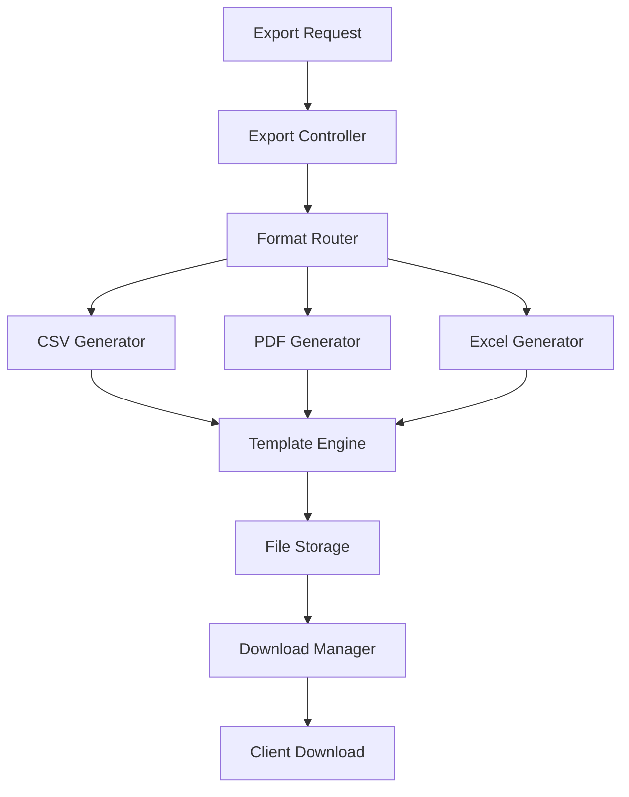

# Enhanced Export System Implementation

## 🎯 **Overview**
Comprehensive export system supporting CSV, PDF, and Excel formats with advanced formatting, templates, and batch processing capabilities.

## 🏗️ **Architecture Design**

### **System Components**


### **Core Services Structure**
```typescript
// src/lib/export/types.ts
export interface ExportRequest {
  format: 'csv' | 'pdf' | 'excel';
  data: any[];
  template: ExportTemplate;
  options: ExportOptions;
  metadata: ExportMetadata;
}

export interface ExportTemplate {
  name: string;
  type: 'player-card' | 'leaderboard' | 'summary-report' | 'alliance-report';
  layout: LayoutConfig;
  styling: StyleConfig;
  fields: FieldConfig[];
}

export interface ExportResult {
  success: boolean;
  fileUrl?: string;
  fileName: string;
  fileSize: number;
  downloadToken: string;
  expiresAt: Date;
  error?: string;
}
```

## 📊 **Implementation Details**

### **1. Enhanced Export Service**
```typescript
// src/lib/export/ExportService.ts
import { jsPDF } from 'jspdf';
import 'jspdf-autotable';
import ExcelJS from 'exceljs';

export class ExportService {
  private static templates: Map<string, ExportTemplate> = new Map();
  private static cache: Map<string, ExportResult> = new Map();

  static async exportData(request: ExportRequest): Promise<ExportResult> {
    try {
      // Validate request
      this.validateRequest(request);
      
      // Check cache
      const cacheKey = this.generateCacheKey(request);
      if (this.cache.has(cacheKey)) {
        return this.cache.get(cacheKey)!;
      }

      // Generate export based on format
      let result: ExportResult;
      switch (request.format) {
        case 'csv':
          result = await this.generateCSV(request);
          break;
        case 'pdf':
          result = await this.generatePDF(request);
          break;
        case 'excel':
          result = await this.generateExcel(request);
          break;
        default:
          throw new Error(`Unsupported format: ${request.format}`);
      }

      // Cache result
      this.cache.set(cacheKey, result);
      
      // Schedule cleanup
      setTimeout(() => this.cache.delete(cacheKey), 3600000); // 1 hour

      return result;
    } catch (error) {
      return {
        success: false,
        fileName: '',
        fileSize: 0,
        downloadToken: '',
        expiresAt: new Date(),
        error: error instanceof Error ? error.message : 'Unknown error'
      };
    }
  }

  private static async generateCSV(request: ExportRequest): Promise<ExportResult> {
    const { data, template, options } = request;
    
    // Apply template configuration
    const headers = template.fields.map(field => field.header);
    const rows = data.map(item => 
      template.fields.map(field => this.formatValue(item[field.key], field.type))
    );

    // Generate CSV content
    const csvContent = [
      headers.join(','),
      ...rows.map(row => row.map(cell => this.escapeCsvValue(cell)).join(','))
    ].join('\n');

    // Add BOM for Excel compatibility
    const bom = '\uFEFF';
    const finalContent = bom + csvContent;

    // Save to storage
    const fileName = this.generateFileName(request, 'csv');
    const fileUrl = await this.saveToStorage(finalContent, fileName, 'text/csv');
    
    return {
      success: true,
      fileUrl,
      fileName,
      fileSize: finalContent.length,
      downloadToken: this.generateDownloadToken(),
      expiresAt: new Date(Date.now() + 24 * 60 * 60 * 1000) // 24 hours
    };
  }

  private static async generatePDF(request: ExportRequest): Promise<ExportResult> {
    const { data, template, options } = request;
    
    const doc = new jsPDF({
      orientation: template.layout.orientation || 'portrait',
      unit: 'mm',
      format: template.layout.format || 'a4'
    });

    // Add header
    if (template.layout.header) {
      this.addPDFHeader(doc, template.layout.header, options.metadata);
    }

    // Generate content based on template type
    switch (template.type) {
      case 'player-card':
        await this.generatePlayerCardPDF(doc, data[0], template);
        break;
      case 'leaderboard':
        await this.generateLeaderboardPDF(doc, data, template);
        break;
      case 'summary-report':
        await this.generateSummaryReportPDF(doc, data, template);
        break;
      case 'alliance-report':
        await this.generateAllianceReportPDF(doc, data, template);
        break;
    }

    // Add footer
    if (template.layout.footer) {
      this.addPDFFooter(doc, template.layout.footer);
    }

    // Generate buffer
    const pdfBuffer = doc.output('arraybuffer');
    
    // Save to storage
    const fileName = this.generateFileName(request, 'pdf');
    const fileUrl = await this.saveToStorage(pdfBuffer, fileName, 'application/pdf');
    
    return {
      success: true,
      fileUrl,
      fileName,
      fileSize: pdfBuffer.byteLength,
      downloadToken: this.generateDownloadToken(),
      expiresAt: new Date(Date.now() + 24 * 60 * 60 * 1000)
    };
  }

  private static async generateExcel(request: ExportRequest): Promise<ExportResult> {
    const { data, template, options } = request;
    
    const workbook = new ExcelJS.Workbook();
    workbook.creator = 'Player Tracker';
    workbook.created = new Date();

    // Create worksheet
    const worksheet = workbook.addWorksheet(template.name);

    // Apply styling
    if (template.styling) {
      this.applyExcelStyling(worksheet, template.styling);
    }

    // Add data based on template type
    switch (template.type) {
      case 'leaderboard':
        this.addLeaderboardToExcel(worksheet, data, template);
        break;
      case 'summary-report':
        this.addSummaryToExcel(worksheet, data, template);
        break;
      default:
        this.addGenericDataToExcel(worksheet, data, template);
    }

    // Generate buffer
    const buffer = await workbook.xlsx.writeBuffer();
    
    // Save to storage
    const fileName = this.generateFileName(request, 'xlsx');
    const fileUrl = await this.saveToStorage(buffer, fileName, 'application/vnd.openxmlformats-officedocument.spreadsheetml.sheet');
    
    return {
      success: true,
      fileUrl,
      fileName,
      fileSize: buffer.byteLength,
      downloadToken: this.generateDownloadToken(),
      expiresAt: new Date(Date.now() + 24 * 60 * 60 * 1000)
    };
  }

  // Helper methods
  private static validateRequest(request: ExportRequest): void {
    if (!request.data || request.data.length === 0) {
      throw new Error('No data provided for export');
    }
    if (!request.template) {
      throw new Error('No template specified');
    }
    if (!['csv', 'pdf', 'excel'].includes(request.format)) {
      throw new Error('Invalid export format');
    }
  }

  private static formatValue(value: any, type: string): string {
    if (value === null || value === undefined) return '';
    
    switch (type) {
      case 'number':
        return typeof value === 'number' ? value.toLocaleString() : String(value);
      case 'currency':
        return new Intl.NumberFormat('en-US', { style: 'currency', currency: 'USD' }).format(value);
      case 'date':
        return new Date(value).toLocaleDateString();
      case 'percentage':
        return `${(value * 100).toFixed(2)}%`;
      default:
        return String(value);
    }
  }

  private static escapeCsvValue(value: string): string {
    if (value.includes(',') || value.includes('"') || value.includes('\n')) {
      return `"${value.replace(/"/g, '""')}"`;
    }
    return value;
  }

  private static generateFileName(request: ExportRequest, extension: string): string {
    const timestamp = new Date().toISOString().replace(/[:.]/g, '-');
    const templateName = request.template.name.replace(/\s+/g, '_');
    return `${templateName}_${timestamp}.${extension}`;
  }

  private static generateCacheKey(request: ExportRequest): string {
    return `export_${request.format}_${JSON.stringify(request.template)}_${request.data.length}`;
  }

  private static generateDownloadToken(): string {
    return Math.random().toString(36).substring(2, 15) + Math.random().toString(36).substring(2, 15);
  }

  private static async saveToStorage(content: any, fileName: string, mimeType: string): Promise<string> {
    // Implementation depends on storage solution (AWS S3, local filesystem, etc.)
    // For now, return a mock URL
    return `/api/downloads/${fileName}`;
  }
}
```

### **2. PDF Generation Templates**
```typescript
// src/lib/export/pdf/PDFTemplates.ts
export class PDFTemplates {
  static async generatePlayerCard(doc: jsPDF, player: any, template: ExportTemplate): Promise<void> {
    const pageWidth = doc.internal.pageSize.getWidth();
    const pageHeight = doc.internal.pageSize.getHeight();
    
    // Header section
    doc.setFontSize(20);
    doc.setFont('helvetica', 'bold');
    doc.text('Player Profile', pageWidth / 2, 20, { align: 'center' });
    
    // Player basic info
    doc.setFontSize(16);
    doc.text(player.name, pageWidth / 2, 35, { align: 'center' });
    
    doc.setFontSize(12);
    doc.setFont('helvetica', 'normal');
    doc.text(`Alliance: ${player.alliance || 'None'}`, 20, 50);
    doc.text(`Power: ${player.power?.toLocaleString() || 'N/A'}`, 20, 60);
    doc.text(`Level: ${player.level || 'N/A'}`, 20, 70);
    
    // Stats table
    const statsData = [
      ['Metric', 'Value'],
      ['Kill Points', player.killPoints?.toLocaleString() || '0'],
      ['Troop Kills', player.troopKills?.toLocaleString() || '0'],
      ['Deaths', player.deads?.toLocaleString() || '0'],
      ['City Level', player.level?.toString() || 'N/A']
    ];
    
    (doc as any).autoTable({
      head: [statsData[0]],
      body: statsData.slice(1),
      startY: 85,
      theme: 'grid',
      styles: { fontSize: 10 },
      headStyles: { fillColor: [66, 139, 202] }
    });
    
    // Add charts/graphs if needed
    if (template.layout.includeCharts) {
      await this.addPlayerCharts(doc, player, 150);
    }
    
    // Footer
    doc.setFontSize(8);
    doc.text(`Generated on ${new Date().toLocaleDateString()}`, pageWidth / 2, pageHeight - 10, { align: 'center' });
  }

  static async generateLeaderboardPDF(doc: jsPDF, data: any[], template: ExportTemplate): Promise<void> {
    const pageWidth = doc.internal.pageSize.getWidth();
    
    // Title
    doc.setFontSize(18);
    doc.setFont('helvetica', 'bold');
    doc.text('Kingdom Leaderboard', pageWidth / 2, 20, { align: 'center' });
    
    // Prepare table data
    const tableData = data.map((player, index) => [
      (index + 1).toString(),
      player.name,
      player.alliance || 'None',
      player.power?.toLocaleString() || '0',
      player.killPoints?.toLocaleString() || '0'
    ]);
    
    // Create table
    (doc as any).autoTable({
      head: [['Rank', 'Player', 'Alliance', 'Power', 'Kill Points']],
      body: tableData,
      startY: 35,
      theme: 'striped',
      styles: { fontSize: 9 },
      headStyles: { fillColor: [52, 73, 94] },
      alternateRowStyles: { fillColor: [245, 245, 245] }
    });
  }

  private static async addPlayerCharts(doc: jsPDF, player: any, startY: number): Promise<void> {
    // This would integrate with a chart library to generate chart images
    // For now, we'll add placeholder text
    doc.setFontSize(12);
    doc.setFont('helvetica', 'bold');
    doc.text('Performance Charts', 20, startY);
    
    doc.setFont('helvetica', 'normal');
    doc.setFontSize(10);
    doc.text('• Power progression over time', 25, startY + 15);
    doc.text('• Combat statistics breakdown', 25, startY + 25);
    doc.text('• Alliance contribution metrics', 25, startY + 35);
  }
}
```

### **3. API Endpoints**
```typescript
// src/app/api/export/route.ts
import { NextRequest, NextResponse } from 'next/server';
import { ExportService } from '@/lib/export/ExportService';
import { getServerSession } from 'next-auth';

export async function POST(request: NextRequest) {
  try {
    const session = await getServerSession();
    if (!session) {
      return NextResponse.json({ error: 'Unauthorized' }, { status: 401 });
    }

    const exportRequest = await request.json();
    
    // Validate permissions
    if (!await hasExportPermission(session.user, exportRequest.template.type)) {
      return NextResponse.json({ error: 'Insufficient permissions' }, { status: 403 });
    }

    const result = await ExportService.exportData(exportRequest);
    
    if (!result.success) {
      return NextResponse.json({ error: result.error }, { status: 500 });
    }

    return NextResponse.json(result);
  } catch (error) {
    console.error('Export error:', error);
    return NextResponse.json({ error: 'Export failed' }, { status: 500 });
  }
}

// src/app/api/export/download/[token]/route.ts
export async function GET(request: NextRequest, { params }: { params: { token: string } }) {
  try {
    const { token } = params;
    
    // Validate download token
    const fileInfo = await validateDownloadToken(token);
    if (!fileInfo) {
      return NextResponse.json({ error: 'Invalid or expired token' }, { status: 404 });
    }

    // Stream file
    const fileStream = await getFileStream(fileInfo.filePath);
    
    return new NextResponse(fileStream, {
      headers: {
        'Content-Type': fileInfo.mimeType,
        'Content-Disposition': `attachment; filename="${fileInfo.fileName}"`,
        'Content-Length': fileInfo.fileSize.toString()
      }
    });
  } catch (error) {
    return NextResponse.json({ error: 'Download failed' }, { status: 500 });
  }
}
```

### **4. Frontend Components**
```typescript
// src/components/export/ExportDialog.tsx
import { useState } from 'react';
import { Dialog, DialogContent, DialogHeader, DialogTitle } from '@/components/ui/dialog';
import { Button } from '@/components/ui/button';
import { Select, SelectContent, SelectItem, SelectTrigger, SelectValue } from '@/components/ui/select';

interface ExportDialogProps {
  isOpen: boolean;
  onClose: () => void;
  data: any[];
  dataType: 'players' | 'leaderboard' | 'alliances';
}

export function ExportDialog({ isOpen, onClose, data, dataType }: ExportDialogProps) {
  const [format, setFormat] = useState<'csv' | 'pdf' | 'excel'>('csv');
  const [template, setTemplate] = useState<string>('default');
  const [isExporting, setIsExporting] = useState(false);
  const [progress, setProgress] = useState(0);

  const handleExport = async () => {
    setIsExporting(true);
    setProgress(0);

    try {
      const exportRequest = {
        format,
        data,
        template: getTemplate(template, dataType),
        options: {
          metadata: {
            exportedBy: 'Current User',
            exportedAt: new Date(),
            dataType
          }
        }
      };

      // Start export
      const response = await fetch('/api/export', {
        method: 'POST',
        headers: { 'Content-Type': 'application/json' },
        body: JSON.stringify(exportRequest)
      });

      if (!response.ok) {
        throw new Error('Export failed');
      }

      const result = await response.json();
      
      // Trigger download
      window.open(`/api/export/download/${result.downloadToken}`, '_blank');
      
      onClose();
    } catch (error) {
      console.error('Export error:', error);
      // Show error message
    } finally {
      setIsExporting(false);
      setProgress(0);
    }
  };

  return (
    <Dialog open={isOpen} onOpenChange={onClose}>
      <DialogContent className="sm:max-w-md">
        <DialogHeader>
          <DialogTitle>Export Data</DialogTitle>
        </DialogHeader>
        
        <div className="space-y-4">
          <div>
            <label className="text-sm font-medium">Format</label>
            <Select value={format} onValueChange={(value: any) => setFormat(value)}>
              <SelectTrigger>
                <SelectValue />
              </SelectTrigger>
              <SelectContent>
                <SelectItem value="csv">CSV</SelectItem>
                <SelectItem value="excel">Excel</SelectItem>
                <SelectItem value="pdf">PDF</SelectItem>
              </SelectContent>
            </Select>
          </div>

          <div>
            <label className="text-sm font-medium">Template</label>
            <Select value={template} onValueChange={setTemplate}>
              <SelectTrigger>
                <SelectValue />
              </SelectTrigger>
              <SelectContent>
                <SelectItem value="default">Default</SelectItem>
                <SelectItem value="detailed">Detailed</SelectItem>
                <SelectItem value="summary">Summary</SelectItem>
              </SelectContent>
            </Select>
          </div>

          {isExporting && (
            <div className="space-y-2">
              <div className="text-sm text-gray-600">Exporting...</div>
              <div className="w-full bg-gray-200 rounded-full h-2">
                <div 
                  className="bg-blue-600 h-2 rounded-full transition-all duration-300"
                  style={{ width: `${progress}%` }}
                />
              </div>
            </div>
          )}

          <div className="flex justify-end space-x-2">
            <Button variant="outline" onClick={onClose} disabled={isExporting}>
              Cancel
            </Button>
            <Button onClick={handleExport} disabled={isExporting}>
              {isExporting ? 'Exporting...' : 'Export'}
            </Button>
          </div>
        </div>
      </DialogContent>
    </Dialog>
  );
}
```

## 🚀 **Implementation Steps**

### **Phase 1: Core Infrastructure (Week 1)**
1. Set up export service architecture
2. Implement basic CSV generation
3. Create file storage system
4. Add download token management

### **Phase 2: PDF Generation (Week 1)**
1. Integrate jsPDF library
2. Create PDF templates
3. Implement player card generation
4. Add chart integration

### **Phase 3: Excel Enhancement (Week 2)**
1. Enhance Excel generation
2. Add advanced formatting
3. Create multiple worksheet support
4. Implement data validation

### **Phase 4: Frontend Integration (Week 2)**
1. Create export dialog component
2. Add progress tracking
3. Implement batch export
4. Add export history

## 📊 **Success Metrics**
- Export generation time: < 10 seconds for 1000 records
- File size optimization: < 5MB for standard reports
- Success rate: > 99%
- User satisfaction: > 90%

This implementation provides a robust, scalable export system that can handle various data types and formats while maintaining performance and user experience.