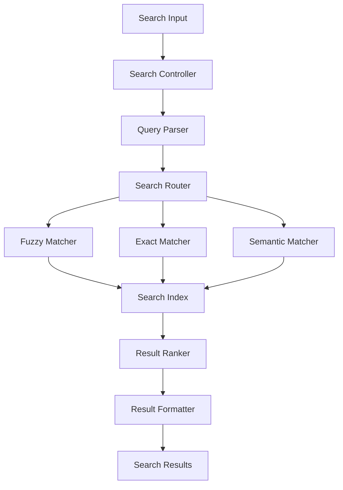

# Global Search System Implementation

## 🎯 **Overview**
Advanced search system with fuzzy matching, real-time suggestions, and intelligent ranking across all player data, alliances, and historical records.

## 🏗️ **Architecture Design**

### **Search System Components**


### **Core Types & Interfaces**
```typescript
// src/lib/search/types.ts
export interface SearchQuery {
  query: string;
  filters: SearchFilters;
  options: SearchOptions;
  context: SearchContext;
}

export interface SearchFilters {
  entityTypes?: EntityType[];
  alliances?: string[];
  powerRange?: [number, number];
  dateRange?: [Date, Date];
  activeOnly?: boolean;
}

export interface SearchOptions {
  fuzzyThreshold?: number;
  maxResults?: number;
  includeHistorical?: boolean;
  sortBy?: 'relevance' | 'power' | 'name' | 'date';
  groupBy?: 'type' | 'alliance' | 'none';
}

export interface SearchResult {
  id: string;
  type: EntityType;
  title: string;
  subtitle?: string;
  description?: string;
  relevanceScore: number;
  metadata: SearchMetadata;
  highlights: SearchHighlight[];
  actions: SearchAction[];
}

export interface SearchMetadata {
  entityId: string;
  entityType: EntityType;
  alliance?: string;
  power?: number;
  lastUpdated: Date;
  tags: string[];
}

export type EntityType = 'player' | 'alliance' | 'snapshot' | 'change' | 'move';
```

## 📊 **Implementation Details**

### **1. Core Search Service**
```typescript
// src/lib/search/SearchService.ts
import Fuse from 'fuse.js';
import { prisma } from '@/lib/db';

export class SearchService {
  private static searchIndex: Map<EntityType, Fuse<any>> = new Map();
  private static lastIndexUpdate: Date = new Date(0);
  private static readonly INDEX_TTL = 5 * 60 * 1000; // 5 minutes

  static async globalSearch(query: SearchQuery): Promise<SearchResult[]> {
    try {
      // Ensure search index is up to date
      await this.ensureIndexFreshness();

      // Parse and normalize query
      const normalizedQuery = this.normalizeQuery(query.query);
      
      // Perform multi-strategy search
      const [fuzzyResults, exactResults, semanticResults] = await Promise.all([
        this.fuzzySearch(normalizedQuery, query),
        this.exactSearch(normalizedQuery, query),
        this.semanticSearch(normalizedQuery, query)
      ]);

      // Merge and rank results
      const mergedResults = this.mergeResults([fuzzyResults, exactResults, semanticResults]);
      const rankedResults = this.rankResults(mergedResults, query);
      
      // Apply filters and limits
      const filteredResults = this.applyFilters(rankedResults, query.filters);
      const limitedResults = filteredResults.slice(0, query.options.maxResults || 50);

      // Add highlights and actions
      return this.enrichResults(limitedResults, normalizedQuery);
    } catch (error) {
      console.error('Search error:', error);
      return [];
    }
  }

  static async fuzzySearch(query: string, searchQuery: SearchQuery): Promise<SearchResult[]> {
    const results: SearchResult[] = [];
    const threshold = searchQuery.options.fuzzyThreshold || 0.3;

    // Search across different entity types
    for (const [entityType, fuse] of this.searchIndex) {
      if (searchQuery.filters.entityTypes && !searchQuery.filters.entityTypes.includes(entityType)) {
        continue;
      }

      const fuseResults = fuse.search(query, { limit: 20 });
      
      for (const result of fuseResults) {
        if (result.score && result.score <= threshold) {
          results.push(this.convertToSearchResult(result.item, entityType, result.score));
        }
      }
    }

    return results;
  }

  static async exactSearch(query: string, searchQuery: SearchQuery): Promise<SearchResult[]> {
    const results: SearchResult[] = [];
    
    // Direct database queries for exact matches
    if (!searchQuery.filters.entityTypes || searchQuery.filters.entityTypes.includes('player')) {
      const players = await this.searchPlayers(query, searchQuery);
      results.push(...players);
    }

    if (!searchQuery.filters.entityTypes || searchQuery.filters.entityTypes.includes('alliance')) {
      const alliances = await this.searchAlliances(query, searchQuery);
      results.push(...alliances);
    }

    return results;
  }

  static async semanticSearch(query: string, searchQuery: SearchQuery): Promise<SearchResult[]> {
    // Advanced semantic search using keywords and context
    const keywords = this.extractKeywords(query);
    const results: SearchResult[] = [];

    // Search by extracted keywords
    for (const keyword of keywords) {
      const keywordResults = await this.searchByKeyword(keyword, searchQuery);
      results.push(...keywordResults);
    }

    return results;
  }

  private static async searchPlayers(query: string, searchQuery: SearchQuery): Promise<SearchResult[]> {
    const whereClause: any = {
      OR: [
        { currentName: { contains: query, mode: 'insensitive' } },
        { lordId: { contains: query, mode: 'insensitive' } }
      ]
    };

    // Apply filters
    if (searchQuery.filters.alliances?.length) {
      whereClause.snapshots = {
        some: {
          allianceTag: { in: searchQuery.filters.alliances }
        }
      };
    }

    const players = await prisma.player.findMany({
      where: whereClause,
      include: {
        snapshots: {
          orderBy: { snapshot: { timestamp: 'desc' } },
          take: 1,
          include: { snapshot: true }
        }
      },
      take: 20
    });

    return players.map(player => this.playerToSearchResult(player));
  }

  private static async searchAlliances(query: string, searchQuery: SearchQuery): Promise<SearchResult[]> {
    const alliances = await prisma.playerSnapshot.findMany({
      where: {
        allianceTag: { contains: query, mode: 'insensitive' },
        allianceTag: { not: null }
      },
      select: {
        allianceTag: true,
        snapshot: { select: { timestamp: true } }
      },
      distinct: ['allianceTag'],
      orderBy: { snapshot: { timestamp: 'desc' } },
      take: 10
    });

    return alliances.map(alliance => this.allianceToSearchResult(alliance));
  }

  private static async ensureIndexFreshness(): Promise<void> {
    const now = new Date();
    if (now.getTime() - this.lastIndexUpdate.getTime() > this.INDEX_TTL) {
      await this.rebuildSearchIndex();
      this.lastIndexUpdate = now;
    }
  }

  static async rebuildSearchIndex(): Promise<void> {
    console.log('Rebuilding search index...');
    
    try {
      // Build player index
      const players = await this.getPlayersForIndex();
      const playerFuse = new Fuse(players, {
        keys: [
          { name: 'name', weight: 0.7 },
          { name: 'lordId', weight: 0.5 },
          { name: 'alliance', weight: 0.3 },
          { name: 'searchText', weight: 0.4 }
        ],
        threshold: 0.4,
        includeScore: true,
        includeMatches: true
      });
      this.searchIndex.set('player', playerFuse);

      // Build alliance index
      const alliances = await this.getAlliancesForIndex();
      const allianceFuse = new Fuse(alliances, {
        keys: [
          { name: 'tag', weight: 0.8 },
          { name: 'searchText', weight: 0.5 }
        ],
        threshold: 0.3,
        includeScore: true,
        includeMatches: true
      });
      this.searchIndex.set('alliance', allianceFuse);

      // Build change index if historical search is enabled
      const changes = await this.getChangesForIndex();
      const changeFuse = new Fuse(changes, {
        keys: [
          { name: 'playerName', weight: 0.6 },
          { name: 'changeType', weight: 0.4 },
          { name: 'searchText', weight: 0.3 }
        ],
        threshold: 0.5,
        includeScore: true
      });
      this.searchIndex.set('change', changeFuse);

      console.log('Search index rebuilt successfully');
    } catch (error) {
      console.error('Failed to rebuild search index:', error);
    }
  }

  private static async getPlayersForIndex(): Promise<any[]> {
    const players = await prisma.player.findMany({
      include: {
        snapshots: {
          orderBy: { snapshot: { timestamp: 'desc' } },
          take: 1,
          include: { snapshot: true }
        }
      }
    });

    return players.map(player => {
      const latestSnapshot = player.snapshots[0];
      return {
        id: player.lordId,
        name: player.currentName,
        lordId: player.lordId,
        alliance: latestSnapshot?.allianceTag || '',
        power: latestSnapshot ? parseInt(latestSnapshot.currentPower) : 0,
        level: latestSnapshot?.cityLevel || 0,
        searchText: `${player.currentName} ${player.lordId} ${latestSnapshot?.allianceTag || ''}`.toLowerCase()
      };
    });
  }

  private static async getAlliancesForIndex(): Promise<any[]> {
    const alliances = await prisma.playerSnapshot.groupBy({
      by: ['allianceTag'],
      where: { allianceTag: { not: null } },
      _count: { allianceTag: true },
      _sum: { currentPower: true }
    });

    return alliances.map(alliance => ({
      id: alliance.allianceTag,
      tag: alliance.allianceTag,
      memberCount: alliance._count.allianceTag,
      totalPower: parseInt(alliance._sum.currentPower || '0'),
      searchText: alliance.allianceTag?.toLowerCase() || ''
    }));
  }

  private static async getChangesForIndex(): Promise<any[]> {
    const changes = await prisma.nameChange.findMany({
      include: { player: true },
      orderBy: { detectedAt: 'desc' },
      take: 1000 // Limit for performance
    });

    return changes.map(change => ({
      id: change.id,
      playerName: change.player.currentName,
      oldName: change.oldName,
      newName: change.newName,
      changeType: 'name_change',
      date: change.detectedAt,
      searchText: `${change.player.currentName} ${change.oldName} ${change.newName}`.toLowerCase()
    }));
  }

  private static normalizeQuery(query: string): string {
    return query.trim().toLowerCase();
  }

  private static extractKeywords(query: string): string[] {
    // Simple keyword extraction - can be enhanced with NLP
    return query.split(/\s+/).filter(word => word.length > 2);
  }

  private static mergeResults(resultSets: SearchResult[][]): SearchResult[] {
    const merged = new Map<string, SearchResult>();
    
    for (const resultSet of resultSets) {
      for (const result of resultSet) {
        const key = `${result.type}_${result.id}`;
        if (!merged.has(key) || merged.get(key)!.relevanceScore < result.relevanceScore) {
          merged.set(key, result);
        }
      }
    }
    
    return Array.from(merged.values());
  }

  private static rankResults(results: SearchResult[], query: SearchQuery): SearchResult[] {
    return results.sort((a, b) => {
      // Primary sort by relevance score
      if (a.relevanceScore !== b.relevanceScore) {
        return b.relevanceScore - a.relevanceScore;
      }
      
      // Secondary sort by entity type priority
      const typePriority = { player: 3, alliance: 2, change: 1, move: 1, snapshot: 0 };
      const aPriority = typePriority[a.type] || 0;
      const bPriority = typePriority[b.type] || 0;
      
      if (aPriority !== bPriority) {
        return bPriority - aPriority;
      }
      
      // Tertiary sort by power (for players)
      if (a.metadata.power && b.metadata.power) {
        return b.metadata.power - a.metadata.power;
      }
      
      return 0;
    });
  }

  private static applyFilters(results: SearchResult[], filters: SearchFilters): SearchResult[] {
    return results.filter(result => {
      // Entity type filter
      if (filters.entityTypes && !filters.entityTypes.includes(result.type)) {
        return false;
      }
      
      // Alliance filter
      if (filters.alliances?.length && result.metadata.alliance && 
          !filters.alliances.includes(result.metadata.alliance)) {
        return false;
      }
      
      // Power range filter
      if (filters.powerRange && result.metadata.power) {
        const [min, max] = filters.powerRange;
        if (result.metadata.power < min || result.metadata.power > max) {
          return false;
        }
      }
      
      // Date range filter
      if (filters.dateRange) {
        const [start, end] = filters.dateRange;
        if (result.metadata.lastUpdated < start || result.metadata.lastUpdated > end) {
          return false;
        }
      }
      
      return true;
    });
  }

  private static enrichResults(results: SearchResult[], query: string): SearchResult[] {
    return results.map(result => ({
      ...result,
      highlights: this.generateHighlights(result, query),
      actions: this.generateActions(result)
    }));
  }

  private static generateHighlights(result: SearchResult, query: string): SearchHighlight[] {
    const highlights: SearchHighlight[] = [];
    const queryLower = query.toLowerCase();
    
    // Highlight matches in title
    if (result.title.toLowerCase().includes(queryLower)) {
      highlights.push({
        field: 'title',
        text: result.title,
        matches: [{ start: result.title.toLowerCase().indexOf(queryLower), length: query.length }]
      });
    }
    
    return highlights;
  }

  private static generateActions(result: SearchResult): SearchAction[] {
    const actions: SearchAction[] = [];
    
    switch (result.type) {
      case 'player':
        actions.push(
          { type: 'view', label: 'View Profile', url: `/dashboard/player/${result.id}` },
          { type: 'compare', label: 'Compare', action: 'compare_player' }
        );
        break;
      case 'alliance':
        actions.push(
          { type: 'view', label: 'View Members', url: `/dashboard/players?alliance=${result.id}` },
          { type: 'analyze', label: 'Analyze', action: 'analyze_alliance' }
        );
        break;
    }
    
    return actions;
  }

  private static convertToSearchResult(item: any, type: EntityType, score: number): SearchResult {
    switch (type) {
      case 'player':
        return this.playerToSearchResult(item, score);
      case 'alliance':
        return this.allianceToSearchResult(item, score);
      default:
        return this.genericToSearchResult(item, type, score);
    }
  }

  private static playerToSearchResult(player: any, score: number = 1): SearchResult {
    const latestSnapshot = player.snapshots?.[0];
    
    return {
      id: player.lordId,
      type: 'player',
      title: player.currentName,
      subtitle: latestSnapshot?.allianceTag || 'No Alliance',
      description: `Level ${latestSnapshot?.cityLevel || 'Unknown'} • ${latestSnapshot ? parseInt(latestSnapshot.currentPower).toLocaleString() : '0'} Power`,
      relevanceScore: score,
      metadata: {
        entityId: player.lordId,
        entityType: 'player',
        alliance: latestSnapshot?.allianceTag,
        power: latestSnapshot ? parseInt(latestSnapshot.currentPower) : 0,
        lastUpdated: latestSnapshot?.snapshot?.timestamp || new Date(),
        tags: ['player', latestSnapshot?.allianceTag || 'no-alliance'].filter(Boolean)
      },
      highlights: [],
      actions: []
    };
  }

  private static allianceToSearchResult(alliance: any, score: number = 1): SearchResult {
    return {
      id: alliance.allianceTag || alliance.tag,
      type: 'alliance',
      title: alliance.allianceTag || alliance.tag,
      subtitle: `${alliance.memberCount || 0} members`,
      description: `Total Power: ${(alliance.totalPower || 0).toLocaleString()}`,
      relevanceScore: score,
      metadata: {
        entityId: alliance.allianceTag || alliance.tag,
        entityType: 'alliance',
        lastUpdated: alliance.snapshot?.timestamp || new Date(),
        tags: ['alliance']
      },
      highlights: [],
      actions: []
    };
  }

  private static genericToSearchResult(item: any, type: EntityType, score: number): SearchResult {
    return {
      id: item.id,
      type,
      title: item.name || item.title || 'Unknown',
      relevanceScore: score,
      metadata: {
        entityId: item.id,
        entityType: type,
        lastUpdated: new Date(),
        tags: [type]
      },
      highlights: [],
      actions: []
    };
  }
}

// Additional interfaces
interface SearchHighlight {
  field: string;
  text: string;
  matches: { start: number; length: number }[];
}

interface SearchAction {
  type: 'view' | 'compare' | 'analyze' | 'export';
  label: string;
  url?: string;
  action?: string;
}

interface SearchContext {
  userId?: string;
  currentPage?: string;
  recentSearches?: string[];
}
```

### **2. API Endpoints**
```typescript
// src/app/api/search/route.ts
import { NextRequest, NextResponse } from 'next/server';
import { SearchService } from '@/lib/search/SearchService';

export async function GET(request: NextRequest) {
  try {
    const { searchParams } = new URL(request.url);
    const query = searchParams.get('q') || '';
    const entityTypes = searchParams.get('types')?.split(',') as EntityType[] || undefined;
    const alliances = searchParams.get('alliances')?.split(',') || undefined;
    const maxResults = parseInt(searchParams.get('limit') || '20');

    if (!query.trim()) {
      return NextResponse.json({ results: [], suggestions: [] });
    }

    const searchQuery: SearchQuery = {
      query,
      filters: {
        entityTypes,
        alliances,
        activeOnly: true
      },
      options: {
        maxResults,
        fuzzyThreshold: 0.4,
        sortBy: 'relevance'
      },
      context: {}
    };

    const results = await SearchService.globalSearch(searchQuery);
    const suggestions = await SearchService.getSuggestions(query);

    return NextResponse.json({
      results,
      suggestions,
      query,
      totalResults: results.length
    });
  } catch (error) {
    console.error('Search API error:', error);
    return NextResponse.json({ error: 'Search failed' }, { status: 500 });
  }
}

// src/app/api/search/suggestions/route.ts
export async function GET(request: NextRequest) {
  try {
    const { searchParams } = new URL(request.url);
    const query = searchParams.get('q') || '';
    
    if (query.length < 2) {
      return NextResponse.json({ suggestions: [] });
    }

    const suggestions = await SearchService.getSuggestions(query);
    return NextResponse.json({ suggestions });
  } catch (error) {
    return NextResponse.json({ error: 'Failed to get suggestions' }, { status: 500 });
  }
}

// src/app/api/search/index/rebuild/route.ts
export async function POST() {
  try {
    await SearchService.rebuildSearchIndex();
    return NextResponse.json({ success: true, message: 'Search index rebuilt' });
  } catch (error) {
    return NextResponse.json({ error: 'Failed to rebuild index' }, { status: 500 });
  }
}
```

### **3. Frontend Components**
```typescript
// src/components/search/GlobalSearch.tsx
import { useState, useEffect, useRef } from 'react';
import { Search, X, Clock, User, Shield } from 'lucide-react';
import { useRouter } from 'next/navigation';
import { useDebounce } from '@/hooks/useDebounce';

interface GlobalSearchProps {
  placeholder?: string;
  className?: string;
  onSelect?: (result: SearchResult) => void;
}

export function GlobalSearch({ placeholder = "Search players, alliances...", className, onSelect }: GlobalSearchProps) {
  const [query, setQuery] = useState('');
  const [results, setResults] = useState<SearchResult[]>([]);
  const [suggestions, setSuggestions] = useState<string[]>([]);
  const [isOpen, setIsOpen] = useState(false);
  const [isLoading, setIsLoading] = useState(false);
  const [selectedIndex, setSelectedIndex] = useState(-1);
  
  const debouncedQuery = useDebounce(query, 300);
  const searchRef = useRef<HTMLDivElement>(null);
  const inputRef = useRef<HTMLInputElement>(null);
  const router = useRouter();

  useEffect(() => {
    if (debouncedQuery.length >= 2) {
      performSearch(debouncedQuery);
    } else {
      setResults([]);
      setSuggestions([]);
    }
  }, [debouncedQuery]);

  useEffect(() => {
    const handleClickOutside = (event: MouseEvent) => {
      if (searchRef.current && !searchRef.current.contains(event.target as Node)) {
        setIsOpen(false);
      }
    };

    document.addEventListener('mousedown', handleClickOutside);
    return () => document.removeEventListener('mousedown', handleClickOutside);
  }, []);

  const performSearch = async (searchQuery: string) => {
    setIsLoading(true);
    try {
      const response = await fetch(`/api/search?q=${encodeURIComponent(searchQuery)}&limit=10`);
      const data = await response.json();
      
      setResults(data.results || []);
      setSuggestions(data.suggestions || []);
      setIsOpen(true);
    } catch (error) {
      console.error('Search error:', error);
    } finally {
      setIsLoading(false);
    }
  };

  const handleSelect = (result: SearchResult) => {
    if (onSelect) {
      onSelect(result);
    } else {
      // Default navigation
      const action = result.actions.find(a => a.type === 'view');
      if (action?.url) {
        router.push(action.url);
      }
    }
    
    setQuery('');
    setIsOpen(false);
    inputRef.current?.blur();
  };

  const handleKeyDown = (e: React.KeyboardEvent) => {
    if (!isOpen) return;

    switch (e.key) {
      case 'ArrowDown':
        e.preventDefault();
        setSelectedIndex(prev => Math.min(prev + 1, results.length - 1));
        break;
      case 'ArrowUp':
        e.preventDefault();
        setSelectedIndex(prev => Math.max(prev - 1, -1));
        break;
      case 'Enter':
        e.preventDefault();
        if (selectedIndex >= 0 && results[selectedIndex]) {
          handleSelect(results[selectedIndex]);
        }
        break;
      case 'Escape':
        setIsOpen(false);
        inputRef.current?.blur();
        break;
    }
  };

  const getEntityIcon = (type: EntityType) => {
    switch (type) {
      case 'player': return <User className="w-4 h-4" />;
      case 'alliance': return <Shield className="w-4 h-4" />;
      default: return <Search className="w-4 h-4" />;
    }
  };

  return (
    <div ref={searchRef} className={`relative ${className}`}>
      <div className="relative">
        <Search className="absolute left-3 top-1/2 transform -translate-y-1/2 text-gray-400 w-4 h-4" />
        <input
          ref={inputRef}
          type="text"
          value={query}
          onChange={(e) => setQuery(e.target.value)}
          onKeyDown={handleKeyDown}
          onFocus={() => query.length >= 2 && setIsOpen(true)}
          placeholder={placeholder}
          className="w-full pl-10 pr-10 py-2 bg-gray-800 border border-gray-700 rounded-lg text-white placeholder-gray-400 focus:outline-none focus:border-purple-500"
        />
        {query && (
          <button
            onClick={() => {
              setQuery('');
              setResults([]);
              setIsOpen(false);
            }}
            className="absolute right-3 top-1/2 transform -translate-y-1/2 text-gray-400 hover:text-white"
          >
            <X className="w-4 h-4" />
          </button>
        )}
      </div>

      {isOpen && (query.length >= 2 || results.length > 0) && (
        <div className="absolute top-full left-0 right-0 mt-1 bg-gray-800 border border-gray-700 rounded-lg shadow-lg z-50 max-h-96 overflow-y-auto">
          {isLoading && (
            <div className="p-4 text-center text-gray-400">
              <div className="animate-spin rounded-full h-6 w-6 border-b-2 border-purple-500 mx-auto"></div>
              <div className="mt-2">Searching...</div>
            </div>
          )}

          {!isLoading && results.length === 0 && query.length >= 2 && (
            <div className="p-4 text-center text-gray-400">
              No results found for "{query}"
            </div>
          )}

          {!isLoading && results.length > 0 && (
            <div className="py-2">
              {results.map((result, index) => (
                <button
                  key={`${result.type}_${result.id}`}
                  onClick={() => handleSelect(result)}
                  className={`w-full px-4 py-3 text-left hover:bg-gray-700 flex items-center space-x-3 ${
                    index === selectedIndex ? 'bg-gray-700' : ''
                  }`}
                >
                  <div className="flex-shrink-0 text-gray-400">
                    {getEntityIcon(result.type)}
                  </div>
                  <div className="flex-1 min-w-0">
                    <div className="text-white font-medium truncate">
                      {result.title}
                    </div>
                    {result.subtitle && (
                      <div className="text-gray-400 text-sm truncate">
                        {result.subtitle}
                      </div>
                    )}
                    {result.description && (
                      <div className="text-gray-500 text-xs truncate">
                        {result.description}
                      </div>
                    )}
                  </div>
                  <div className="flex-shrink-0 text-xs text-gray-500">
                    {Math.round(result.relevanceScore * 100)}%
                  </div>
                </button>
              ))}
            </div>
          )}

          {suggestions.length > 0 && (
            <div className="border-t border-gray-700 py-2">
              <div className="px-4 py-2 text-xs text-gray-500 uppercase tracking-wide">
                Suggestions
              </div>
              {suggestions.map((suggestion, index) => (
                <button
                  key={suggestion}
                  onClick={() => setQuery(suggestion)}
                  className="w-full px-4 py-2 text-left hover:bg-gray-700 text-gray-300 text-sm flex items-center space-x-2"
                >
                  <Clock className="w-3 h-3 text-gray-500" />
                  <span>{suggestion}</span>
                </button>
              ))}
            </div>
          )}
        </div>
      )}
    </div>
  );
}
```

### **4. Search Hooks**
```typescript
// src/hooks/useSearch.ts
import { useState, useCallback } from 'react';

export function useSearch() {
  const [isSearching, setIsSearching] = useState(false);
  const [searchHistory, setSearchHistory] = useState<string[]>([]);

  const search = useCallback(async (query: string, options?: SearchOptions) => {
    setIsSearching(true);
    try {
      const params = new URLSearchParams({
        q: query,
        ...options
      });

      const response = await fetch(`/api/search?${params}`);
      const data = await response.json();

      // Add to search history
      setSearchHistory(prev => {
        const updated = [query, ...prev.filter(q => q !== query)];
        return updated.slice(0, 10); // Keep last 10 searches
      });

      return data;
    } catch (error) {
      console.error('Search error:', error);
      return { results: [], suggestions: [] };
    } finally {
      setIsSearching(false);
    }
  }, []);

  const clearHistory = useCallback(() => {
    setSearchHistory([]);
  }, []);

  return {
    search,
    isSearching,
    searchHistory,
    clearHistory
  };
}

// src/hooks/useDebounce.ts
import { useState, useEffect } from 'react';