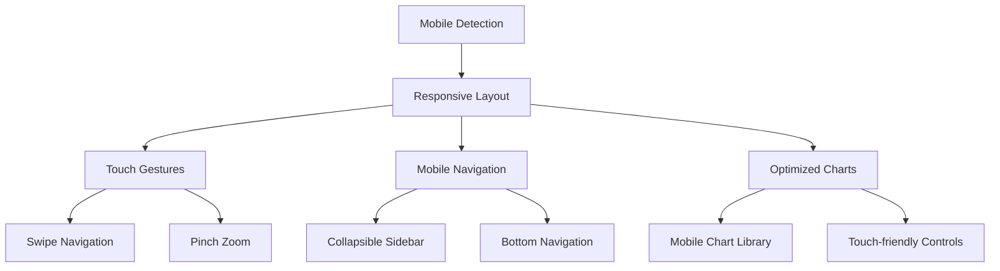

# Mobile Optimization Implementation

## 🎯 **Overview**
Comprehensive mobile optimization strategy focusing on responsive design, touch interactions, performance, and mobile-specific user experience enhancements.

## 🏗️ **Architecture Design**

### **Mobile Optimization Components**


### **Core Types & Interfaces**
```typescript
// src/lib/mobile/types.ts
export interface MobileConfig {
  breakpoints: Breakpoints;
  gestures: GestureConfig;
  navigation: NavigationConfig;
  performance: PerformanceConfig;
}

export interface Breakpoints {
  mobile: number;
  tablet: number;
  desktop: number;
  largeDesktop: number;
}

export interface GestureConfig {
  swipeThreshold: number;
  pinchThreshold: number;
  tapDelay: number;
  longPressDelay: number;
}

export interface TouchEvent {
  type: 'tap' | 'swipe' | 'pinch' | 'longpress';
  direction?: 'left' | 'right' | 'up' | 'down';
  distance?: number;
  scale?: number;
  target: HTMLElement;
}

export interface ViewportInfo {
  width: number;
  height: number;
  isMobile: boolean;
  isTablet: boolean;
  isDesktop: boolean;
  orientation: 'portrait' | 'landscape';
  pixelRatio: number;
}
```

## 📊 **Implementation Details**

### **1. Responsive Design System**
```typescript
// src/lib/mobile/ResponsiveManager.ts
export class ResponsiveManager {
  private static instance: ResponsiveManager;
  private breakpoints: Breakpoints = {
    mobile: 768,
    tablet: 1024,
    desktop: 1440,
    largeDesktop: 1920
  };
  private listeners: Set<(viewport: ViewportInfo) => void> = new Set();
  private currentViewport: ViewportInfo;

  static getInstance(): ResponsiveManager {
    if (!ResponsiveManager.instance) {
      ResponsiveManager.instance = new ResponsiveManager();
    }
    return ResponsiveManager.instance;
  }

  constructor() {
    this.currentViewport = this.calculateViewport();
    this.setupListeners();
  }

  private setupListeners(): void {
    if (typeof window === 'undefined') return;

    const handleResize = () => {
      const newViewport = this.calculateViewport();
      if (this.hasViewportChanged(newViewport)) {
        this.currentViewport = newViewport;
        this.notifyListeners(newViewport);
      }
    };

    const handleOrientationChange = () => {
      // Delay to ensure dimensions are updated
      setTimeout(handleResize, 100);
    };

    window.addEventListener('resize', handleResize);
    window.addEventListener('orientationchange', handleOrientationChange);
    
    // Cleanup function would be called on unmount
    this.cleanup = () => {
      window.removeEventListener('resize', handleResize);
      window.removeEventListener('orientationchange', handleOrientationChange);
    };
  }

  private calculateViewport(): ViewportInfo {
    if (typeof window === 'undefined') {
      return {
        width: 1920,
        height: 1080,
        isMobile: false,
        isTablet: false,
        isDesktop: true,
        orientation: 'landscape',
        pixelRatio: 1
      };
    }

    const width = window.innerWidth;
    const height = window.innerHeight;
    const isMobile = width < this.breakpoints.mobile;
    const isTablet = width >= this.breakpoints.mobile && width < this.breakpoints.desktop;
    const isDesktop = width >= this.breakpoints.desktop;

    return {
      width,
      height,
      isMobile,
      isTablet,
      isDesktop,
      orientation: width > height ? 'landscape' : 'portrait',
      pixelRatio: window.devicePixelRatio || 1
    };
  }

  private hasViewportChanged(newViewport: ViewportInfo): boolean {
    return (
      newViewport.width !== this.currentViewport.width ||
      newViewport.height !== this.currentViewport.height ||
      newViewport.orientation !== this.currentViewport.orientation
    );
  }

  private notifyListeners(viewport: ViewportInfo): void {
    this.listeners.forEach(listener => listener(viewport));
  }

  subscribe(listener: (viewport: ViewportInfo) => void): () => void {
    this.listeners.add(listener);
    // Return unsubscribe function
    return () => this.listeners.delete(listener);
  }

  getCurrentViewport(): ViewportInfo {
    return this.currentViewport;
  }

  isMobile(): boolean {
    return this.currentViewport.isMobile;
  }

  isTablet(): boolean {
    return this.currentViewport.isTablet;
  }

  isDesktop(): boolean {
    return this.currentViewport.isDesktop;
  }

  getBreakpoint(): 'mobile' | 'tablet' | 'desktop' | 'large' {
    const { width } = this.currentViewport;
    if (width < this.breakpoints.mobile) return 'mobile';
    if (width < this.breakpoints.tablet) return 'tablet';
    if (width < this.breakpoints.largeDesktop) return 'desktop';
    return 'large';
  }

  private cleanup?: () => void;
}
```

### **2. Touch Gesture System**
```typescript
// src/lib/mobile/TouchGestureManager.ts
export class TouchGestureManager {
  private element: HTMLElement;
  private config: GestureConfig;
  private touchStart: Touch | null = null;
  private touchCurrent: Touch | null = null;
  private gestureStart: { x: number; y: number; time: number } | null = null;
  private isGesturing = false;
  private listeners: Map<string, Set<(event: TouchEvent) => void>> = new Map();

  constructor(element: HTMLElement, config: Partial<GestureConfig> = {}) {
    this.element = element;
    this.config = {
      swipeThreshold: 50,
      pinchThreshold: 0.1,
      tapDelay: 300,
      longPressDelay: 500,
      ...config
    };

    this.setupEventListeners();
  }

  private setupEventListeners(): void {
    this.element.addEventListener('touchstart', this.handleTouchStart.bind(this), { passive: false });
    this.element.addEventListener('touchmove', this.handleTouchMove.bind(this), { passive: false });
    this.element.addEventListener('touchend', this.handleTouchEnd.bind(this), { passive: false });
    this.element.addEventListener('touchcancel', this.handleTouchCancel.bind(this));
  }

  private handleTouchStart(e: TouchEvent): void {
    if (e.touches.length === 1) {
      this.touchStart = e.touches[0];
      this.gestureStart = {
        x: this.touchStart.clientX,
        y: this.touchStart.clientY,
        time: Date.now()
      };

      // Setup long press detection
      setTimeout(() => {
        if (this.gestureStart && !this.isGesturing) {
          this.emitGesture({
            type: 'longpress',
            target: e.target as HTMLElement
          });
        }
      }, this.config.longPressDelay);
    }
  }

  private handleTouchMove(e: TouchEvent): void {
    if (!this.touchStart || !this.gestureStart) return;

    this.touchCurrent = e.touches[0];
    this.isGesturing = true;

    const deltaX = this.touchCurrent.clientX - this.gestureStart.x;
    const deltaY = this.touchCurrent.clientY - this.gestureStart.y;
    const distance = Math.sqrt(deltaX * deltaX + deltaY * deltaY);

    // Handle pinch gestures for multi-touch
    if (e.touches.length === 2) {
      this.handlePinchGesture(e);
      return;
    }

    // Prevent default scrolling for swipe gestures
    if (distance > this.config.swipeThreshold) {
      e.preventDefault();
    }
  }

  private handleTouchEnd(e: TouchEvent): void {
    if (!this.touchStart || !this.gestureStart) return;

    const endTime = Date.now();
    const duration = endTime - this.gestureStart.time;

    if (this.touchCurrent) {
      const deltaX = this.touchCurrent.clientX - this.gestureStart.x;
      const deltaY = this.touchCurrent.clientY - this.gestureStart.y;
      const distance = Math.sqrt(deltaX * deltaX + deltaY * deltaY);

      if (distance > this.config.swipeThreshold) {
        // Determine swipe direction
        const direction = this.getSwipeDirection(deltaX, deltaY);
        this.emitGesture({
          type: 'swipe',
          direction,
          distance,
          target: e.target as HTMLElement
        });
      } else if (duration < this.config.tapDelay && !this.isGesturing) {
        // Simple tap
        this.emitGesture({
          type: 'tap',
          target: e.target as HTMLElement
        });
      }
    }

    this.resetGesture();
  }

  private handleTouchCancel(): void {
    this.resetGesture();
  }

  private handlePinchGesture(e: TouchEvent): void {
    if (e.touches.length !== 2) return;

    const touch1 = e.touches[0];
    const touch2 = e.touches[1];
    
    const currentDistance = Math.sqrt(
      Math.pow(touch2.clientX - touch1.clientX, 2) + 
      Math.pow(touch2.clientY - touch1.clientY, 2)
    );

    // Store initial distance on first pinch move
    if (!this.initialPinchDistance) {
      this.initialPinchDistance = currentDistance;
      return;
    }

    const scale = currentDistance / this.initialPinchDistance;
    
    if (Math.abs(scale - 1) > this.config.pinchThreshold) {
      this.emitGesture({
        type: 'pinch',
        scale,
        target: e.target as HTMLElement
      });
    }
  }

  private getSwipeDirection(deltaX: number, deltaY: number): 'left' | 'right' | 'up' | 'down' {
    if (Math.abs(deltaX) > Math.abs(deltaY)) {
      return deltaX > 0 ? 'right' : 'left';
    } else {
      return deltaY > 0 ? 'down' : 'up';
    }
  }

  private emitGesture(gesture: TouchEvent): void {
    const listeners = this.listeners.get(gesture.type);
    if (listeners) {
      listeners.forEach(listener => listener(gesture));
    }
  }

  private resetGesture(): void {
    this.touchStart = null;
    this.touchCurrent = null;
    this.gestureStart = null;
    this.isGesturing = false;
    this.initialPinchDistance = undefined;
  }

  on(eventType: string, listener: (event: TouchEvent) => void): void {
    if (!this.listeners.has(eventType)) {
      this.listeners.set(eventType, new Set());
    }
    this.listeners.get(eventType)!.add(listener);
  }

  off(eventType: string, listener: (event: TouchEvent) => void): void {
    const listeners = this.listeners.get(eventType);
    if (listeners) {
      listeners.delete(listener);
    }
  }

  destroy(): void {
    this.element.removeEventListener('touchstart', this.handleTouchStart);
    this.element.removeEventListener('touchmove', this.handleTouchMove);
    this.element.removeEventListener('touchend', this.handleTouchEnd);
    this.element.removeEventListener('touchcancel', this.handleTouchCancel);
    this.listeners.clear();
  }

  private initialPinchDistance?: number;
}
```

### **3. Mobile Navigation System**
```typescript
// src/components/mobile/MobileNavigation.tsx
import { useState, useEffect } from 'react';
import { useRouter, usePathname } from 'next/navigation';
import { 
  Home, 
  Users, 
  BarChart3, 
  Trophy, 
  GitBranch, 
  UserCheck, 
  Upload,
  Menu,
  X
} from 'lucide-react';
import { useResponsive } from '@/hooks/useResponsive';

interface NavigationItem {
  id: string;
  label: string;
  icon: React.ComponentType<any>;
  path: string;
  badge?: number;
}

const navigationItems: NavigationItem[] = [
  { id: 'overview', label: 'Overview', icon: Home, path: '/dashboard/overview' },
  { id: 'players', label: 'Players', icon: Users, path: '/dashboard/players' },
  { id: 'progress', label: 'Progress', icon: BarChart3, path: '/dashboard/progress' },
  { id: 'leaderboard', label: 'Leaderboard', icon: Trophy, path: '/dashboard/leaderboard' },
  { id: 'changes', label: 'Changes', icon: GitBranch, path: '/dashboard/changes' },
  { id: 'alliance-moves', label: 'Moves', icon: GitBranch, path: '/dashboard/alliance-moves' },
  { id: 'name-changes', label: 'Names', icon: UserCheck, path: '/dashboard/name-changes' },
  { id: 'upload', label: 'Upload', icon: Upload, path: '/dashboard/upload' }
];

export function MobileNavigation() {
  const [isOpen, setIsOpen] = useState(false);
  const { isMobile, isTablet } = useResponsive();
  const router = useRouter();
  const pathname = usePathname();

  // Close menu when route changes
  useEffect(() => {
    setIsOpen(false);
  }, [pathname]);

  // Don't render on desktop
  if (!isMobile && !isTablet) {
    return null;
  }

  const handleNavigation = (path: string) => {
    router.push(path);
    setIsOpen(false);
  };

  const isActive = (path: string) => pathname === path;

  if (isMobile) {
    return (
      <>
        {/* Mobile Bottom Navigation */}
        <div className="fixed bottom-0 left-0 right-0 bg-gray-900 border-t border-gray-700 z-40">
          <div className="grid grid-cols-4 h-16">
            {navigationItems.slice(0, 3).map((item) => {
              const Icon = item.icon;
              return (
                <button
                  key={item.id}
                  onClick={() => handleNavigation(item.path)}
                  className={`flex flex-col items-center justify-center space-y-1 ${
                    isActive(item.path) 
                      ? 'text-purple-400 bg-gray-800' 
                      : 'text-gray-400 hover:text-white'
                  }`}
                >
                  <Icon className="w-5 h-5" />
                  <span className="text-xs">{item.label}</span>
                  {item.badge && (
                    <span className="absolute top-1 right-1 bg-red-500 text-white text-xs rounded-full w-5 h-5 flex items-center justify-center">
                      {item.badge}
                    </span>
                  )}
                </button>
              );
            })}
            
            {/* Menu Button */}
            <button
              onClick={() => setIsOpen(true)}
              className="flex flex-col items-center justify-center space-y-1 text-gray-400 hover:text-white"
            >
              <Menu className="w-5 h-5" />
              <span className="text-xs">More</span>
            </button>
          </div>
        </div>

        {/* Mobile Menu Overlay */}
        {isOpen && (
          <div className="fixed inset-0 bg-black bg-opacity-50 z-50" onClick={() => setIsOpen(false)}>
            <div className="fixed bottom-0 left-0 right-0 bg-gray-900 rounded-t-lg max-h-96 overflow-y-auto">
              <div className="p-4">
                <div className="flex items-center justify-between mb-4">
                  <h3 className="text-lg font-semibold text-white">Navigation</h3>
                  <button
                    onClick={() => setIsOpen(false)}
                    className="text-gray-400 hover:text-white"
                  >
                    <X className="w-6 h-6" />
                  </button>
                </div>
                
                <div className="grid grid-cols-2 gap-3">
                  {navigationItems.map((item) => {
                    const Icon = item.icon;
                    return (
                      <button
                        key={item.id}
                        onClick={() => handleNavigation(item.path)}
                        className={`flex items-center space-x-3 p-3 rounded-lg ${
                          isActive(item.path)
                            ? 'bg-purple-600 text-white'
                            : 'bg-gray-800 text-gray-300 hover:bg-gray-700'
                        }`}
                      >
                        <Icon className="w-5 h-5" />
                        <span className="text-sm font-medium">{item.label}</span>
                      </button>
                    );
                  })}
                </div>
              </div>
            </div>
          </div>
        )}
      </>
    );
  }

  // Tablet Navigation (Collapsible Sidebar)
  return (
    <div className={`fixed left-0 top-0 h-full bg-gray-900 border-r border-gray-700 z-40 transition-transform duration-300 ${
      isOpen ? 'translate-x-0' : '-translate-x-full'
    }`}>
      <div className="w-64 p-4">
        <div className="flex items-center justify-between mb-6">
          <h2 className="text-xl font-bold text-white">Player Tracker</h2>
          <button
            onClick={() => setIsOpen(false)}
            className="text-gray-400 hover:text-white"
          >
            <X className="w-6 h-6" />
          </button>
        </div>
        
        <nav className="space-y-2">
          {navigationItems.map((item) => {
            const Icon = item.icon;
            return (
              <button
                key={item.id}
                onClick={() => handleNavigation(item.path)}
                className={`w-full flex items-center space-x-3 p-3 rounded-lg text-left ${
                  isActive(item.path)
                    ? 'bg-purple-600 text-white'
                    : 'text-gray-300 hover:bg-gray-800'
                }`}
              >
                <Icon className="w-5 h-5" />
                <span>{item.label}</span>
                {item.badge && (
                  <span className="ml-auto bg-red-500 text-white text-xs rounded-full w-5 h-5 flex items-center justify-center">
                    {item.badge}
                  </span>
                )}
              </button>
            );
          })}
        </nav>
      </div>
    </div>
  );
}
```

### **4. Mobile-Optimized Charts**
```typescript
// src/components/mobile/MobileChart.tsx
import { useEffect, useRef, useState } from 'react';
import { Chart as ChartJS, ChartConfiguration, ChartType } from 'chart.js';
import { useResponsive } from '@/hooks/useResponsive';
import { TouchGestureManager } from '@/lib/mobile/TouchGestureManager';

interface MobileChartProps {
  type: ChartType;
  data: any;
  options?: any;
  className?: string;
}

export function MobileChart({ type, data, options = {}, className }: MobileChartProps) {
  const canvasRef = useRef<HTMLCanvasElement>(null);
  const chartRef = useRef<ChartJS | null>(null);
  const gestureManagerRef = useRef<TouchGestureManager | null>(null);
  const { isMobile, isTablet, currentViewport } = useResponsive();
  const [isZoomed, setIsZoomed] = useState(false);

  useEffect(() => {
    if (!canvasRef.current) return;

    // Mobile-optimized chart options
    const mobileOptions = {
      ...options,
      responsive: true,
      maintainAspectRatio: false,
      interaction: {
        intersect: false,
        mode: 'index' as const,
      },
      plugins: {
        ...options.plugins,
        legend: {
          ...options.plugins?.legend,
          display: !isMobile, // Hide legend on mobile to save space
          position: isMobile ? 'bottom' : 'top',
          labels: {
            ...options.plugins?.legend?.labels,
            boxWidth: isMobile ? 12 : 20,
            padding: isMobile ? 10 : 20,
            font: {
              size: isMobile ? 10 : 12
            }
          }
        },
        tooltip: {
          ...options.plugins?.tooltip,
          enabled: true,
          mode: 'index' as const,
          intersect: false,
          backgroundColor: 'rgba(0, 0, 0, 0.8)',
          titleColor: 'white',
          bodyColor: 'white',
          borderColor: 'rgba(255, 255, 255, 0.1)',
          borderWidth: 1,
          cornerRadius: 8,
          displayColors: !isMobile,
          titleFont: {
            size: isMobile ? 12 : 14
          },
          bodyFont: {
            size: isMobile ? 11 : 13
          }
        }
      },
      scales: {
        ...options.scales,
        x: {
          ...options.scales?.x,
          ticks: {
            ...options.scales?.x?.ticks,
            maxTicksLimit: isMobile ? 5 : 10,
            font: {
              size: isMobile ? 10 : 12
            }
          }
        },
        y: {
          ...options.scales?.y,
          ticks: {
            ...options.scales?.y?.ticks,
            maxTicksLimit: isMobile ? 5 : 8,
            font: {
              size: isMobile ? 10 : 12
            }
          }
        }
      },
      elements: {
        ...options.elements,
        point: {
          ...options.elements?.point,
          radius: isMobile ? 2 : 4,
          hoverRadius: isMobile ? 4 : 6
        },
        line: {
          ...options.elements?.line,
          borderWidth: isMobile ? 1 : 2
        }
      }
    };

    const config: ChartConfiguration = {
      type,
      data,
      options: mobileOptions
    };

    chartRef.current = new ChartJS(canvasRef.current, config);

    // Setup touch gestures for mobile
    if (isMobile || isTablet) {
      setupTouchGestures();
    }

    return () => {
      if (chartRef.current) {
        chartRef.current.destroy();
      }
      if (gestureManagerRef.current) {
        gestureManagerRef.current.destroy();
      }
    };
  }, [type, data, options, isMobile, isTablet]);

  const setupTouchGestures = () => {
    if (!canvasRef.current || !chartRef.current) return;

    gestureManagerRef.current = new TouchGestureManager(canvasRef.current, {
      swipeThreshold: 30,
      pinchThreshold: 0.1
    });

    // Handle pinch to zoom
    gestureManagerRef.current.on('pinch', (event) => {
      if (!chartRef.current) return;

      const chart = chartRef.current;
      const scale = event.scale!;

      if (scale > 1.1) {
        // Zoom in
        zoomChart(1.2);
        setIsZoomed(true);
      } else if (scale < 0.9) {
        // Zoom out
        zoomChart(0.8);
        if (scale < 0.5) {
          resetZoom();
        }
      }
    });

    // Handle swipe for navigation
    gestureManagerRef.current.on('swipe', (event) => {
      if (!chartRef.current || !isZoomed) return;

      const chart = chartRef.current;
      const direction = event.direction!;

      if (direction === 'left' || direction === 'right') {
        panChart(direction === 'left' ? -0.1 : 0.1);
      }
    });

    // Handle double tap to reset zoom
    let lastTap = 0;
    gestureManagerRef.current.on('tap', () => {
      const now = Date.now();
      if (now - lastTap < 300) {
        resetZoom();
      }
      lastTap = now;
    });
  };

  const zoomChart = (factor: number) => {
    if (!chartRef.current) return;

    const chart = chartRef.current;
    chart.zoom(factor);
  };

  const panChart = (delta: number) => {
    if (!chartRef.current) return;

    const chart = chartRef.current;
    chart.pan({ x: delta * chart.width! });
  };

  const resetZoom = () => {
    if (!chartRef.current) return;

    chartRef.current.resetZoom();
    setIsZoomed(false);
  };

  // Calculate height based on device
  const getChartHeight = () => {
    if (isMobile) {
      return currentViewport.orientation === 'portrait' ? '250px' : '200px';
    }
    if (isTablet) {
      return '300px';
    }
    return '400px';
  };

  return (
    <div className={`relative ${className}`}>
      <div 
        style={{ height: getChartHeight() }}
        className="relative"
      >
        <canvas
          ref={canvasRef}
          className="w-full h-full"
          style={{ touchAction: 'none' }} // Prevent default touch behaviors
        />
        
        {/* Mobile chart controls */}
        {(isMobile || isTablet) && (
          <div className="absolute top-2 right-2 flex space-x-1">
            {isZoomed && (
              <button
                onClick={resetZoom}
                className="bg-black bg-opacity-50 text-white p-1 rounded text-xs"
              >
                Reset
              </button>
            )}
          </div>
        )}
      </div>
      
      {/* Mobile chart legend (if hidden from chart) */}
      {isMobile && data.datasets && (
        <div className="mt-2 flex flex-wrap gap-2">
          {data.datasets.map((dataset: any, index: number) => (
            <div key={index} className="flex items-center space-x-1">
              <div 
                className="w-3 h-3 rounded"
                style={{ backgroundColor: dataset.borderColor || dataset.backgroundColor }}
              />
              <span className="text-xs text-gray-300">{dataset.label}</span>
            </div>
          ))}
        </div>
      )}
    </div>
  );
}
```

### **5. Mobile Layout Components**
```typescript
// src/components/mobile/MobileLayout.tsx
import { ReactNode } from 'react';
import { useResponsive } from '@/hooks/useResponsive';
import { MobileNavigation } from './MobileNavigation';
import { MobileHeader } from './MobileHeader';

interface MobileLayoutProps {
  children: ReactNode;
  title?: string;
  showBackButton?: boolean;
  actions?: ReactNode;
}

export function MobileLayout({ children, title, showBackButton, actions }: MobileLayoutProps) {
  const { isMobile, isTablet } = useResponsive();

  if (!isMobile && !isTablet) {
    return <>{children}</>;
  }

  return (
    <div className="min-h-screen bg-gray-900 flex flex-col">
      {/* Mobile Header */}
      <MobileHeader 
        title={title}
        showBackButton={showBackButton}
        actions={actions}
      />
      
      {/* Main Content */}
      <main className="flex-1 overflow-auto pb-20 md:pb-0">
        <div className="p-4">
          {children}
        </div>
      </main>
      
      {/* Mobile Navigation */}
      <MobileNavigation />
    </div>
  );
}

// src/components/mobile/MobileHeader.tsx
import { ReactNode } from 'react';
import { useRouter } from 'next/navigation';
import { ArrowLeft, Menu } from 'lucide-react';

interface MobileHeaderProps {
  title?: string;
  showBackButton?: boolean;
  actions?: ReactNode;
}

export function MobileHeader({ title, showBackButton, actions }: MobileHeaderProps) {
  const router = useRouter();

  return (
    <header className="bg-gray-800 border-b border-gray-700 p-4 flex items-center justify-between">
      <div className="flex items-center space-x-3">
        {showBackButton && (
          <button
            onClick={() => router.back()}
            className="text-gray-400 hover:text-white"
          >
            <ArrowLeft className="w-6 h-6" />
          </button>
        )}
        {title && (
          <h1 className="text-lg font-semibold text-white truncate">{title}</h1>
        )}
      </div>
      
      {actions && (
        <div className="flex items-center space-x-2">
          {actions}
        </div>
      )}
    </header>
  );
}
```

### **6. Responsive Hooks**
```typescript
// src/hooks/useResponsive.ts
import { useState, useEffect } from 'react';
import { ResponsiveManager } from '@/lib/mobile/ResponsiveManager';

export function useResponsive() {
  const [viewport, setViewport] = useState(()